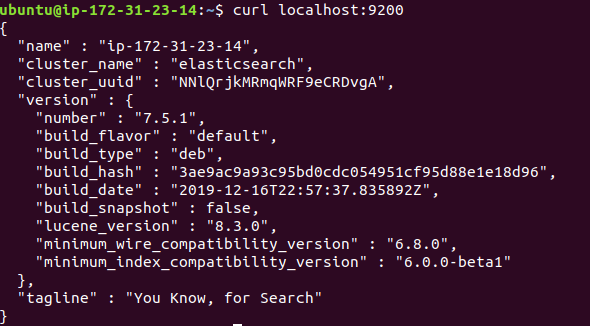

Ansible Role: osm_elasticsearch
=========
An ansible role to install and configure elasticsearch standalone setup.

Version History
---------------

|**Date**| **Version**| **Description**| **Changed By** |
|----------|---------|---------------|-----------------|
|**June '15** | v.1.0 | Initial Draft | Sudipt Sharma |

Supported OS
------------
  * Redhat : 7
  * CentOS : 7
  * Ubuntu : 14/16
  * Amazon Linux

Dependencies
------------
* Java 1.8 or higher
* python

Role Variables/Defaults
-----------------------

|**Variables**| **Default Values**| **Description**|
|----------|---------|---------------|
| elasticsearch_version | "6.5.1" | Elasticsearch version you want to install |
| cluster_name | es-stanalone | Name of the Elasticsearch cluster | 
| es_jvm_dump | /var/lib/elasticsearch/heap | Path for jvm dump |
| data_path | /var/lib/elasticsearch | Place to store Elasticsearch content |
| log_path | /var/log/elasticsearch | Place to store Elasticsearch log |
| http_port | 9200 | elasticsearch http port |
| tcp_port | 9300 | elasticsearch tcp port |
| nproc_limit | 4096 | It is the limit of number of processes for elasticsearch user |
| swapness | 1 | It defines how much RAM content will be copied to swap |

Inventory
----------
An inventory for elasticsearch setup should look like this:-
```ini
[elastichost]                 
192.168.1.198    ansible_user=ubuntu   
192.168.3.201    ansible_user=opstree 
```
Example Playbook
----------------

* Here is an example playbook:-

```
- hosts: es
  roles:
     - { role: osm_elasticSearch }
```
* ansible-playbook elastic.yml

**You can check whether elasticsearch is responding or not by performing curl request to configured port on elasticsearch ip**



Future Proposed Changes
-----------------------

References
----------
- **[software](https://www.elastic.co/)**

Author Information
------------------

- Sumit Anand